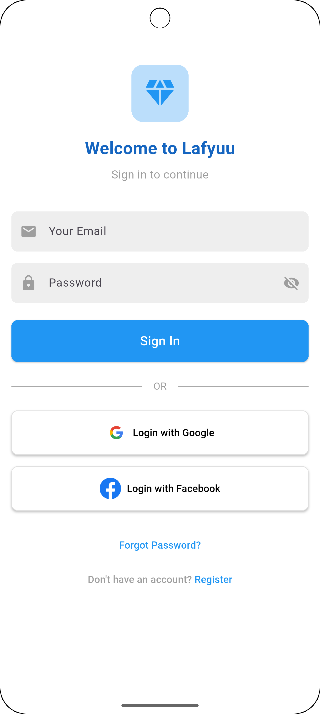

# My Flutter App - Lafyuu Login Screen

A Flutter project featuring a login screen for the "Lafyuu" app. The screen includes fields for email and password, options to log in using Google and Facebook, and links for password recovery and account registration.

## Features

- Custom logo and welcome text.
- Input fields for email and password with a toggle to show/hide the password.
- "Sign In" button.
- Options to log in via Google and Facebook.
- "Forgot Password?" and "Register" links.
- Clean and responsive UI design.

## Screenshots




## Getting Started

### Prerequisites

- Flutter SDK: [Download Flutter here](https://flutter.dev/docs/get-started/install)
- A code editor like [VS Code](https://code.visualstudio.com/) or [Android Studio](https://developer.android.com/studio)

### Installation

1. Clone the repository:
   ```bash
   git clone https://github.com/yourusername/my_flutter_app.git